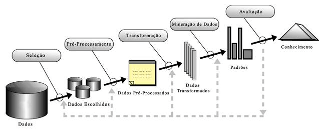

# Data Science

## Origem
A mineração de dados surgiu como área de pesquisa e aplicação independente em meados da década de 1990. 
Entretanto, as suas origens na matemática, estatística e computação são muito
anteriores a esse período ¹. 

## Objetivo
Preparação e análise das grandes massas de dados, tendo a finalidade de encontrar o conhecimento.
Portanto, para cumprir tal finalidade, reuni áreas distintas, como estatística; matemática; engenharia; inteligência artificial; banco de dados; sistemas de informação; visualização; antropologia; e o especialista do domínio dos dados, que se complementam e formam a área de ciência de dados. 

### KDD 

    

1. Dados: 
conjunto de dados organizados de forma *qualitativa* ou *quantitativa* sobre determinado tema, no qual possibilidade a extração de informação que pode resultar em conhecimento.

2. Pré-processamento dos dados: 

Selecionar os dados de acordo com a demanda do estudo, descartando assim dados irrelevantes, a fim de tornar a análise dos eficiente e eficaz. 
As etapas são distribuídas:
* **limpeza:** remoção de ruídos de dados inconsistentes e ausentes;
* **integração:** combinação dos dados de diferentes fontes;
* **seleção:** escolha de dados relevantes à análise; e 
* **transformação:** consolidação dos dados em formato apropriado.

3. Mineração de dados:

Utilização de métricas e medidas estatísticas, para representar o conjunto de dados e a sua distribuição. 
Tais medidas são análise descritiva, agrupamento, predição, associação e detecção de anomalias.

4. Avaliação:

Identificar os padrões obtidos pela representação do conhecimento são válidos, ou seja, representativo.

---

## Conteúdo
* [Editor](https://github.com/codinginbrazil/data-science/blob/main/doc/section/python/editor.tex)             
* [Gerenciamento de pacotes](https://github.com/codinginbrazil/data-science/blob/main/doc/section/python/package_manager.tex)  
* [Bibliotecas essenciais](https://github.com/codinginbrazil/data-science/blob/main/doc/section/python/essential.tex)             
* [Visualização dos dados](https://github.com/codinginbrazil/data-science/blob/main/doc/section/python/view.tex)  
* [Web scraping](https://github.com/codinginbrazil/data-science/blob/main/doc/section/python/web_scraping.tex)
* [Processamento imagem](https://github.com/codinginbrazil/data-science/blob/main/doc/section/python/image.tex)  
* [Aprendizagem de máquina](https://github.com/codinginbrazil/data-science/blob/main/doc/section/python/ml.tex) 

## Referência

### Livro
1. Introdução a mineração de dados por Daniel Gomes Ferrari e Leandro Nunes de Castro Silva
2. [Data Science para Negócios](https://data-science-for-biz.com/)
3. Python para análise de dados por Wes McKinney
4. [Introdução à Ciência de Dados Fundamentos e Aplicações](https://www.ime.usp.br/~jmsinger/MAE5755/cdados2019ago06.pdf)
5. Machine Learning – Guia de Referência Rápida: Trabalhando com dados estruturados em Python

### Blog
* [DIKW by Towards Data Science](https://towardsdatascience.com/rootstrap-dikw-model-32cef9ae6dfb)
* [Curso R](https://blog.curso-r.com/)
* [Tests as linear by Lindeloev](https://lindeloev.github.io/tests-as-linear/)
* [A Titanic Probability](https://web.stanford.edu/class/archive/cs/cs109/cs109.1166/problem12.html)
* https://sigmoidal.ai/data-science-titanic-python-1/
* [Titanic passo a passo com 8 modelos de Machine Learning](https://www.kaggle.com/samukaunt/titanic-passo-a-passo-com-8-modelos-ml-pt-br)

### Data visualization
* [Matplotlib](https://matplotlib.org/api/_as_gen/matplotlib.pyplot.plot.html)
* [Data Visualization – Charts with Matplotlib](https://petamind.com/data-visualization-matplotlib-python-chart/)
* [Data Science: Visualização de Dados com Python](https://www.udemy.com/course/visualizacao-de-dados-com-python/)

### Data Repositories
* [UCI Machine Learning Repository](http://archive.ics.uci.edu/ml/index.php)
* [KDnuggets](https://www.kdnuggets.com/datasets/index.html)
* [Governo Brasileiro](https://dados.gov.br/)
    * [Brasil IO](https://brasil.io/)
    * [Gasto de parlamentar](https://serenata.ai/)
* [Governo Americano](https://www.data.gov/)
* [Governo do Inglês](https://data.gov.uk/)
* [PyData Book](https://github.com/wesm/pydata-book)

### Cursos
* [UFPR](http://cursos.leg.ufpr.br/ML4all/1parte/)

