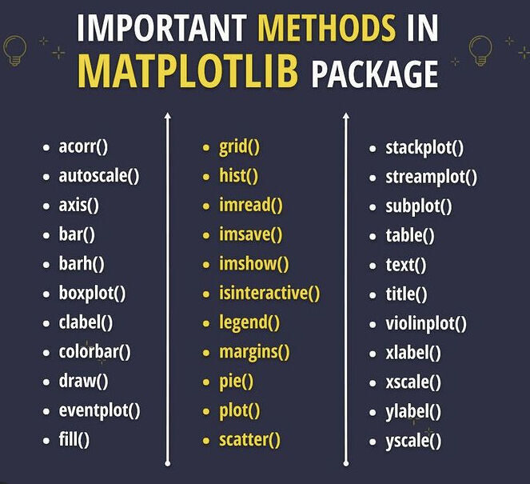
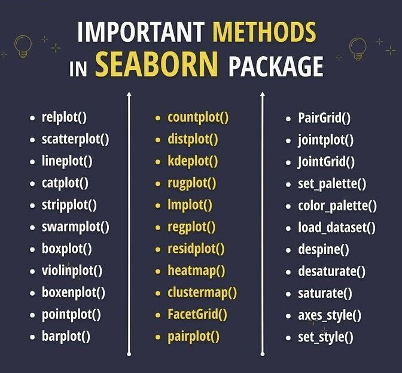

# Data visualization

## [Matplotlib](https://matplotlib.org/)
Gráficos e visualizações de dados em geral, feita para e da linguagem de programação Python e sua extensão de matemática NumPy.

    

## [Seaborn](https://seaborn.pydata.org/)

    

