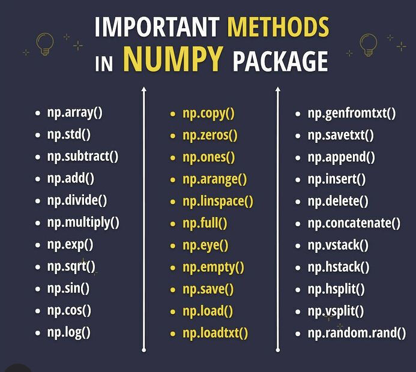
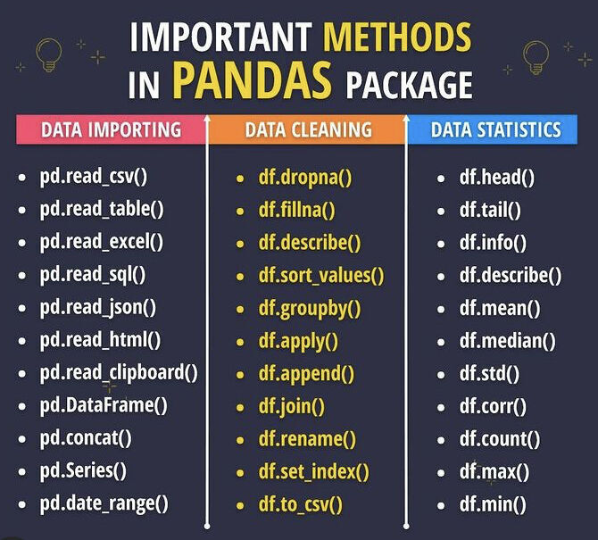

# Math

## NumPy
Pacote para a linguagem Python que suporta arrays e matrizes multidimensionais, possuindo uma larga coleção de funções matemáticas para trabalhar com estas estruturas.

    

## Pandas
Biblioteca de software criada para a linguagem Python para manipulação e análise de dados. Em particular, oferece estruturas e operações para manipular tabelas numéricas e séries temporais. O nome é derivado de painel data.

    

## SymPy
Biblioteca Python para computação simbólica. Ela fornece ferramentas de álgebra computacional tanto como uma aplicação independente como, também, uma biblioteca para outras aplicações

## SciPy
Biblioteca Open Source em linguagem Python que foi feita para matemáticos, cientistas e engenheiros. Também tem o nome de uma popular conferência de programação científica com Python.

## Statsmodels
Pacote Python que permite aos usuários explorar dados, estimar modelos estatísticos e executar testes estatísticos