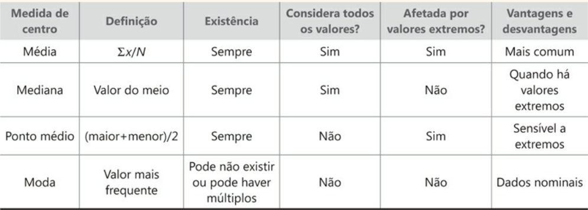

# Análise descritiva de dados

> O processo de análise descritiva de dados, incluindo distribuições de frequência, técnicas de visualização de dados e medidas resumo

## Introdução

Descrever e encontrar o que há nos dados. 
Ao passo que no futuro pode ser implementar algoritmos de mineração que buscam conclusões que extrapolam os dados e permitem inferir predições.
Logo, analise descritiva descreve as características dos dado e a mineração geralmente usada em análise mais abrangentes visando a predição.
Entretanto, precisa ficar atento com falsas correlaçẽs e predições dos dados.

Análise descritiva permite descrever a distribuição e a correlação dos atributos, utilzando medidas estatísticas, como distribuição de frequência, tendência central e visualização gráfica, sendo para atributos univariada e para bivariada relações entre atributos. 

## Processo

1. Distribução de frequência
2. Técnica de visualização
* Histograma
* Polígonos de frequências
* Ogiva
* Gráfico de Pareto
* Gráfico de setores
* Gráfico de dispersão - scatterplots

3. Medidas de tendência central, variação e associação

    

* Moda
* Mediana
* Ponto Médio
$$
    \frac{maior - menor}{2}
$$

* Média 

    * Média amostral:
    $$
    \bar{x} = \frac{1}{n} \sum^{n}_{i=1} x_i
    $$

    * Média populacional:
    $$
    \mu = \frac{1}{n} \sum^{n}_{i=1} x_i
    $$

    * Média de distribuição de frequências

    $$
        \bar{x} = \frac{\sum^{n}_{i=n} f_i * x_i} {\sum^{n}_{i=n} f_i}
    $$

    * Média ponderada: 

    $$
        \bar{x} = 
        \frac{
        \sum^{n}_{i=n} (w_i * x_i) }
        {\sum^{n}_{i=n} w_i}
    $$

    * Média geométrica

    $$
        \bar{x} = (\Pi^n_{i=1} x_i)^{\frac{1}{n}}
    $$

    * Média harmônica 

    $$
        \bar{x} = \frac{n}{\sum^{n}_{i=1} \frac{1}{x_i}} 
    $$

---

* Medidas de dispersão

    * Amplitude

        $$
            amplitude = maior - menor
        $$

    * Desvio padrão

    $$ 
        s = \sqrt{\frac{1}{n-1} \sum^n_{i=1} (x_i - \bar{x})^2}
    $$ 
    $$
        \sigma = \sqrt{\frac{1}{n-1} \sum^n_{i=1} (x_i - \bar{x})^2}
    $$

    * Coeficiente de variação (CV)

    $$
        CV = \frac{\sigma}{\mu} * 100\%
    $$

    * Medidas de forma 

    Assimetria(Skewness) distruição dos dados, assimetria nula(No Skewness) é a curva sino, podendo variar positivamente(Positive Skewness) ou negativamente(Negative Skewness).
    
    Assimetria é calculada da seguinte forma:

    $$
        \gamma = \frac{E(x - \bar{x})^3}{\sigma^3}
    $$

    Curtose Kurtosis é uma medida de dispersão que caracteriza o pico ou achatamento da curva da função de distribuição normal.

    $$
        \beta = \frac{E(x - \bar{x})^4}{\sigma^4}  -3 
    $$

    * Medidas de posição relativa

    Quartils e boxplot

    * Medida de associação

        * Covariância

        $$
            cov(x,y) = \frac{1}{N} \sum^{N}_{i=1} (x - \bar{x}) (y - \bar{y})
        $$

        * Coeficiente de correlação de Person

        Mede a dependência linear entre os atributos de forma linear.

        $$
            \rho(x,y) = \frac{cov(x,y)}{\sigma(x) * \sigma(y)} 
        $$
         
        |    Size of Correlation      |              Interpretation               |
        |-----------------------------|-------------------------------------------|
        | 0.90 to 1.00 (−.90 to −1.0) | Very high positive (negative) correlation |
        | 0.70 to 0.90 (−.70 to −.90) | High positive      (negative) correlation |
        | 0.50 to 0.70 (−.50 to −.70) | Moderate positive  (negative) correlation |
        | 0.30 to 0.50 (−.30 to −.50) | Low positive       (negative) correlation |
        | 0.00 to 0.30 (0.00 to −.30) | Negligible correlation |
        
        [statistical guides](https://statistics.laerd.com/statistical-guides/pearson-correlation-coefficient-statistical-guide.php)

---

* Visualização dos dados

* Medidas de Resumo

    * Medidas de tendência central
    * Medida de dispersão
    * Medida de forma distribuição

    